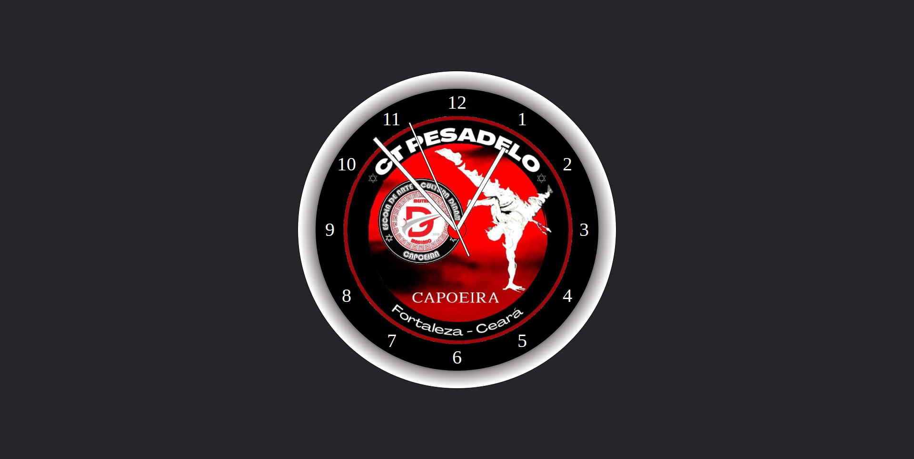
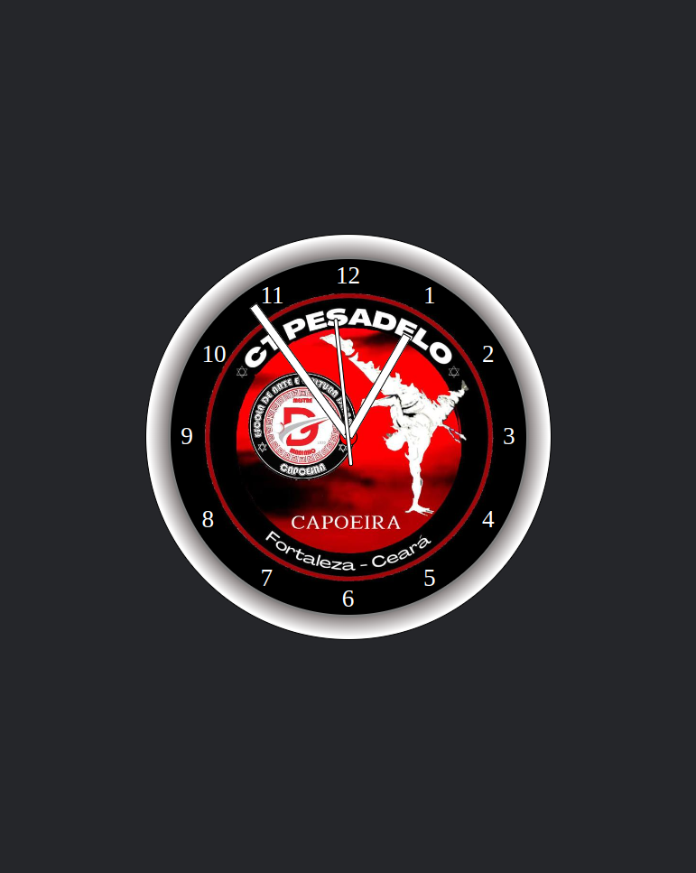
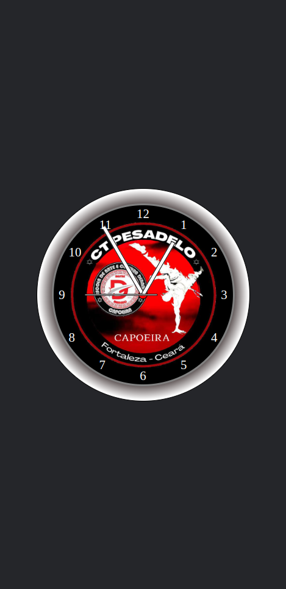

# Relógio web

<h2 align="center">Desktop</h2>

 
 

<h2 align="center">Tablet</h2>

    

 
 

<h2 align="center">Celular</h2>

    

 
 

# Descrição
Este projeto é um relógio analogico para paginas web.

# Versão
1.0.0

# Tecnologias usadas
* HTML
* CSS
* JAVASCRIPT